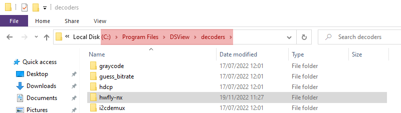
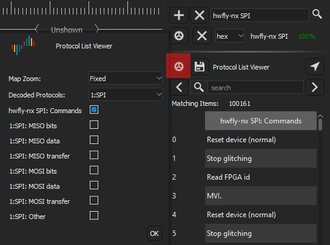

# hwfly-nx DSView decoder

## What's this?

This is a decoder for [DSView](https://github.com/DreamSourceLab/DSView)
(itself a fork of [sigrok](https://sigrok.org/))
that decodes [hwfly-nx](https://github.com/hwfly-nx/firmware) SPI communication
between the MCU (GD32F350CBT6) and the FPGA (Gowin GW1N-1S-QFN32).

## Installation

Copy the entire `hwfly-nx` to the `decoders` subdirectory within DSView install.

## Usage

In decode tab, search for `hwfly-nx`. The `hwfly-nx SPI` should show up:

To configure, you need two important things:

1. All the four pins (`CLK`, `MISO`, `MOSI`, `CS#`)
2. Enable `Frame Decoder`

Then, in `Protocol List Viewer` you can adjust the annotations displayed. I like
just the hwfly ones:

And with that, you're done:

